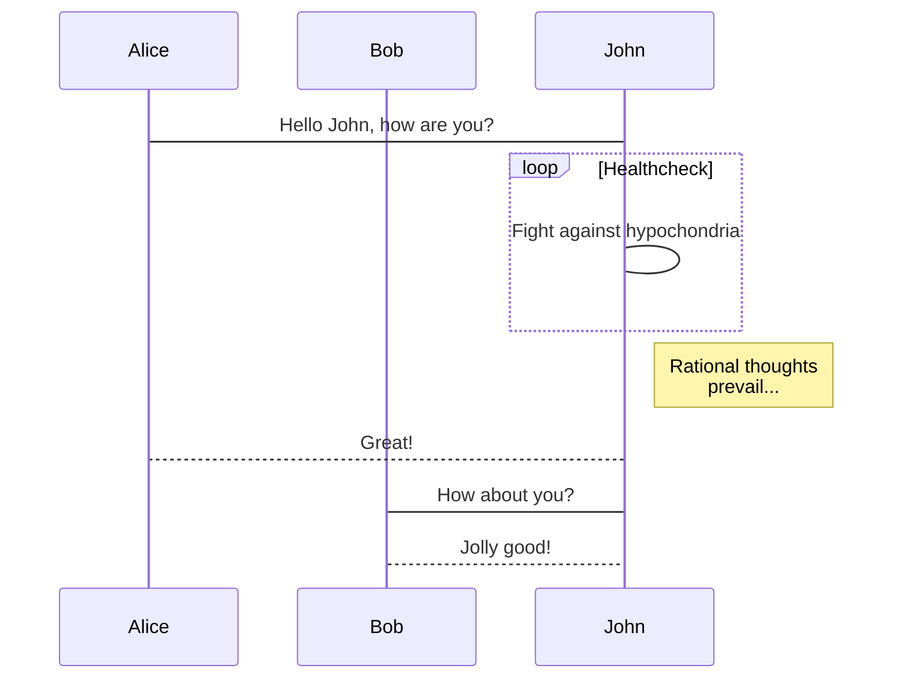

查看完整文档: [mkdocs.org](http://mkdocs.org).

* `mkdocs new [dir-name]` - 创建一个新的工程
* `mkdocs serve` - 实时编辑模式
* `mkdocs build` - 编译站点
* `mkdocs help` - 打印帮助命令

```
# 文件结构

mkdocs.yml    # 配置文件.
    docs/
        index.md  # 主页
        ...       # 其它 markdown 页面、图片、其它文件
```

* [时序图 js-sequence-diagrams](https://bramp.github.io/js-sequence-diagrams/)
    
```sequence
Andrew->China: Says Hello
Note right of China: China thinks\nabout it
China-->Andrew: How are you?
Andrew->>China: I am good thanks!
```

* [流程图 flowchar](http://flowchart.js.org/)

```flow
st=>start: 开始:>http://www.google.com[blank]
e=>end: 结束:>http://www.google.com
op1=>operation: 操作 operation
sub1=>subroutine: 子程序 Subroutine
cond=>condition: 条件:>http://www.google.com
io=>inputoutput: 异常

st->op1->cond
cond(yes)->io->e
cond(no)->sub1(right)->op1
```

* [mermaid](https://mermaidjs.github.io/demos.html) 功能强大

